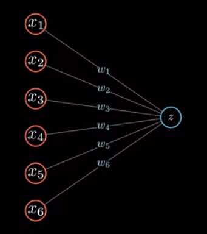

# 神经网络

## 什么是神经网络
我理解的神经网络，是一种提高模型复杂程度的方法，刚才的平面或者说线性模型，只能预测线性关系，而神经网络可以**预测非线性关系**。它通过增加神经元数量，来增加模型的复杂度，从而提高模型的预测能力。
## 非线性关系
对小白来说，非线性关系可能很难从简单的这几个字中表述就能理解，一两个维度可能还好，比如$y=x^2$，但是随着维度的增加，非线性关系就难理解了，比如$y=x^2+x^3$，$y=x^2+x^3+x^4$

但我认为一切还是源于生活，想象一下，你是一个新手川菜厨师。此时你想做一碗重庆酸辣粉，如果你只知道加醋，每次加固定量的醋，那么最终的味道只能是醋味的线性变化。但现实中的美食往往需要复杂的调味，比如酸辣粉需要加盐才会让风味更佳，这就是为什么酸中还带咸的原因，这些不同味道的组合会产生全新的、无法简单叠加的风味。这就像是神经网络中的非线性关系

## 最简单的神经网络

还是之前的例子：

$$z = W_1x_1+W_2x_2+...+W_nx_n+b$$

**用神经网络来表达**：

其中：
- 输入层：$x_1,x_2,...,x_n$
- 输出层：$z$

 但别忘了，之前我们有讲过还需要一个函数来衡量这个$z$的好坏